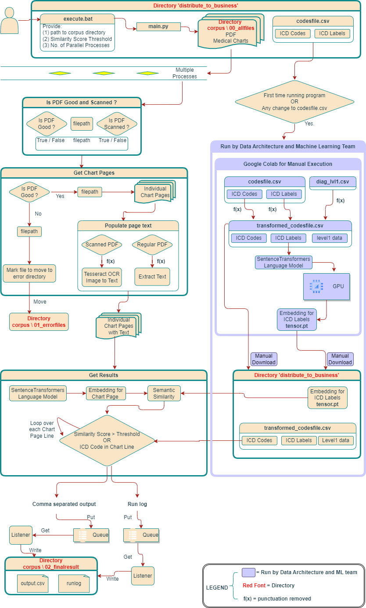
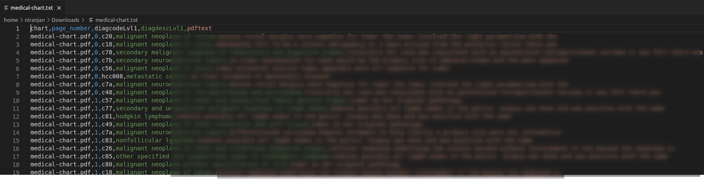
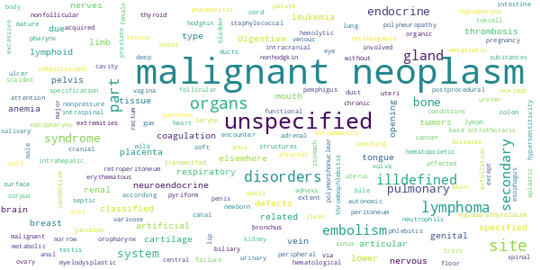
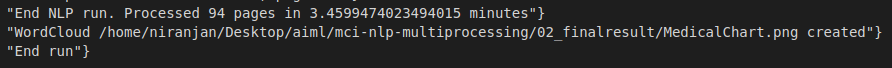

# MEDICAL CHARTS INDEXER - Multiprocessing for NLP using SentenceTransformers and WordCloud

***

## Description :-

Medical charts, used extensively in clinical or health insurance settings, are extremely valuable to identify clinical aspects of a patient. This project saves time and accuracy in finding these clinical aspects, which would otherwise have to be done by an errorprone manual effort for many hours.

<a href="https://www.sbert.net/">SentenceTransformers</a> is a Python framework for Natural Language Processing (NLP). It can be used to compute sentence and text embeddings. This project uses SentenceTransformers to compute semantic similarity between pre-defined diagnosis codes/labels and text in medical charts. A wordcloud is also computed so as to quickly grasp dominant themes in the medical chart.

Code in this project is developed in Python using Multiprocessing (process pools). Pre-computation for text embeddings is done on . 

At a high level, these are the steps:

1. Pre-compute text embeddings on Google Colab. Download embeddings and transformed diagnosis codesfile. This is necessary for high speed in the application itself.
2. Create Multiprocessing pool and dispatch tasks to the pool.
    * File is read from directory *00_allfiles/*, 
    * If file is bad, move it to directory *01_errorfiles/*,
    * If file is good, text in the file is extracted, 
    * Semantic similarity score is computed using SentenceTransformers,
    * Presence of diagnosis code in the text is determined,
    * Output is written to directory *02_finalresult/*.
3. Use can also choose to create a word cloud, which again the user has an option to download.

***

## Screenshots :-
Architecture of the Tool

NLP Result

WordCloud

Last few lines of 02_finalresult/runlog.txt

***